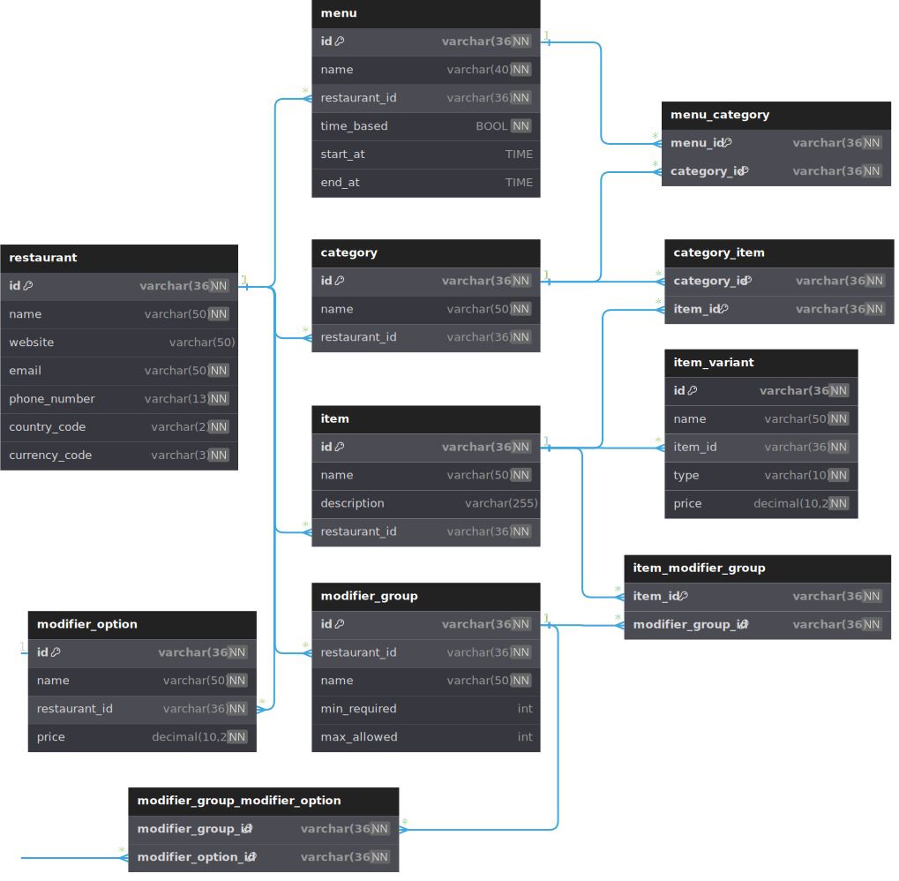

# menu-service

## Table Of Contents

* [Requirements](#requirements)
* [Database Design & Design Decisions](#database-design---design-decisions)
* [Specification of the Main Tables](misc/database-table-spec.md)

## Requirements

- Java 17
- Quarkus 3.13.2
- Docker

### Running the application locally

* Use the following command to start the application locally. Quarkus will spin up a mysql instance using test
  containers and sample data in `resources/db/sample-data` will be added to the database.

```shell
mvn compile quarkus:dev
```

* Use the following curl the fetch the menu from sample data.

```shell
curl --location 'http://localhost:8080/' \
--header 'Content-Type: application/json' \
--data '{
"restaurantId": "b30c8aba-7784-4d24-9c7e-5f9c8eeb1153"
}'
```

### Sample Menu Response

Refer [this file](misc/menu-response-sample.json) for more detailed sample response.

```jsonc
{
  "result": {
    "menus": [
      {
        "id": "75b81533-5d6d-11ef-bee2-0242ac110003",
        "name": "All Day",
        "timeBased": false,
        "startAt": "00:00:00",
        "endAt": "23:59:59",
        // Ids of the categories served under this menu
        "categoryIds": [
          "75b87563-5d6d-11ef-bee2-0242ac110003",
          "75b8a396-5d6d-11ef-bee2-0242ac110003"
        ]
      },
      ...
    ],
    "categories": [
      {
        "id": "75b87563-5d6d-11ef-bee2-0242ac110003",
        "name": "Vegetarian Pizza",
        // Ids of the items service under this category
        "itemIds": [
          "75b8d9de-5d6d-11ef-bee2-0242ac110003",
          "75b90aae-5d6d-11ef-bee2-0242ac110003"
        ]
      },
      ...
    ],
    "items": [
      {
        "id": "75b8d9de-5d6d-11ef-bee2-0242ac110003",
        "name": "Cheese Pizza",
        "description": "All children like pressed chicken lards in gold tequila and butterscotch.",
        "variants": [
          {
            "id": "75be53d0-5d6d-11ef-bee2-0242ac110003",
            "name": "Small",
            "type": "SIZE",
            "price": "7.99"
          },
          ...
        ],
        // Ids of the modifier groups available for this item
        "modifierGroupIds": [
          "75bf7276-5d6d-11ef-bee2-0242ac110003",
          "75bfe9a0-5d6d-11ef-bee2-0242ac110003"
        ]
      },
      ...
    ],
    "modifierGroups": [
      {
        "id": "75bf7276-5d6d-11ef-bee2-0242ac110003",
        "name": "Sauce",
        "minRequired": 0,
        "maxAllowed": 0,
        // Ids of the modifier options available for this modifier group
        "modifierOptionIds": [
          "75c1a9b3-5d6d-11ef-bee2-0242ac110003",
          "75c1e36b-5d6d-11ef-bee2-0242ac110003"
        ]
      },
      ...
    ],
    "modifierOptions": [
      {
        "id": "75c1a9b3-5d6d-11ef-bee2-0242ac110003",
        "name": "Ketchup",
        "price": "0.00"
      },
      ...
    ]
  },
  "requestId": "af1a71e7-965f-4a6c-ab0a-34c286e62813",
  "success": true
}
```

## Database Design & Design Decisions



- Please refer [this page](misc/database-table-spec.md) for the detailed specification of the main tables.
- `restaurant` table holds the data related to a specific restaurant.
- `menu` table holds the data related to menus available at the restaurant (Eg: breakfast, lunch).
- `category` table holds the data related to categories of a menu.
- `item` table holds the data related to items of a menu.
- `modifier_group` table holds the data related modifier groups available for items. (Eg: Available addons for an item)
- `modifier_option` table holds the data related modifier option available for modifier groups. (Eg: Addon options)
- `item_variant` table holds the data related to variants of a specific item. (Eg: Sizes of a pizza like small, medium
  and large)
- `menu_category` mapping table has been introduced since a category can belong to multiple menus and a menu can include
  multiple categories.
- `category_item` mapping table has been introduced since a category can include multiple items and an item can belong
  to multiple categories.
- `item_modifier_group` mapping table has been introduced since an item can include multiple modifier groups and a
  modifier group can belong to multiple items.
- `modifier_group_modifier_option` mapping table has been introduced since a modifier group can include multiple
  modifier options and a modifier option can belong to multiple modifier groups.

## Future Enhancements

* Incorporate a caching mechanism rather than hitting the database everytime a menu is requested. 

